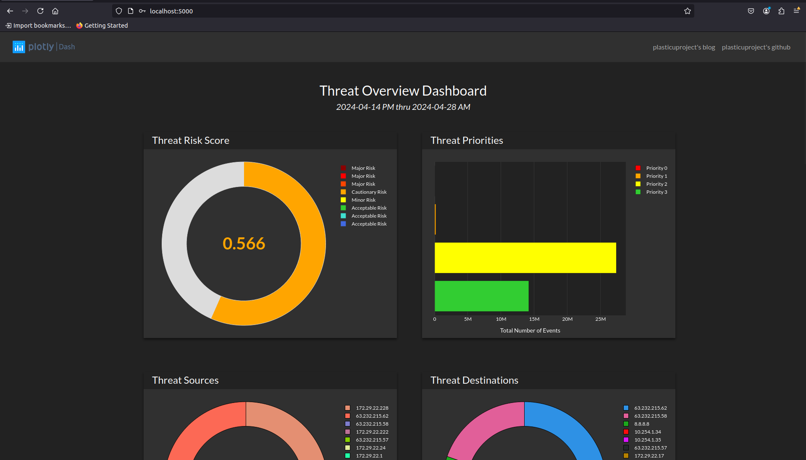
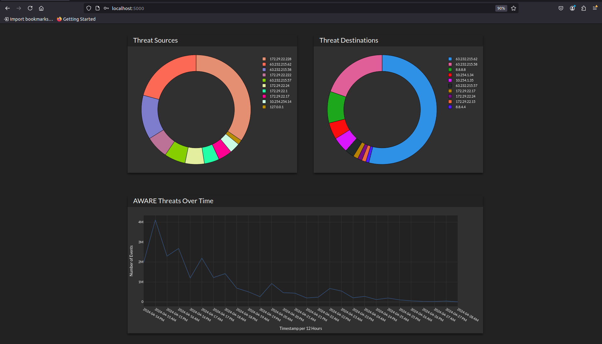
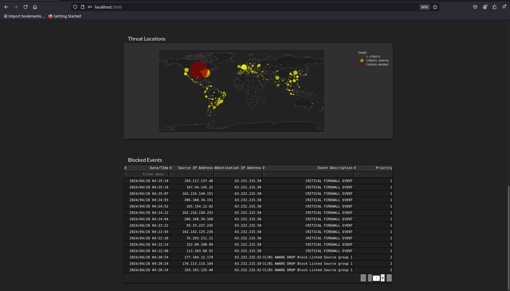

# Threat Overview Dashboard Demo

This project is a demo of an interactive Plotly/Dash dashboard that showcases my ability to create visually appealing and functional dashboards in Python. The dashboard uses simulated data to populate various custom graphs, tables, and visualizations.

## Prerequisites

-   **Docker**: Ensure that Docker is installed on your machine. You can download and install Docker from [here](https://www.docker.com/get-started).

## Getting Started

Follow the instructions below to build and run the dashboard using Docker.


### Build the Docker Image

First, clone the repository and navigate to the project directory. Then, build the Docker image using the following command: 
```bash
docker build -t todd .
```

### Run the Docker Container

Once the image is built, you can run the Docker container using the following command:
```bash
docker run --rm -p 5000:5000 todd
```

### Access the Dashboard

After running the container, open your web browser and visit [http://localhost:5000](http://localhost:5000). Login with the credentials `changeme:changeme`.

You should see the Threat Overview Dashboard Demo, which showcases the interactive plots and graphs.

## Screenshots






## Project Structure
```bash
├── dashboard                   # Contains the dashboard code and data
├── Dockerfile                  # Dockerfile for building the container
├── install.sh                  # Installation script for setting up the environment
└── supervisord.conf            # Configuration file for supervisord
```
